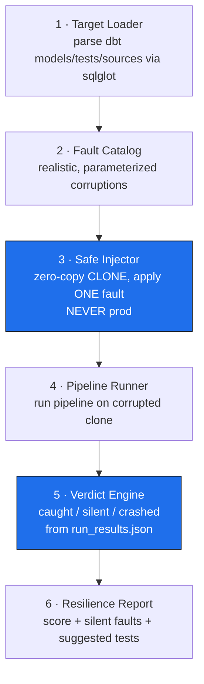

# Data Chaos Monkey

> Chaos engineering for your **data**, not your infrastructure. It injects realistic, subtle data corruptions into a **cloned** pipeline and measures whether your existing tests catch them — then hands you a resilience score and the exact faults that would reach your dashboard *silently*.
> Solo · M4 Pro · ~10–14 focused wks · ~$0–100

**One-line pitch:** *"Chaos Monkey for data. It proves which corruptions your green test suite would let through — safely, without ever touching prod."*

---

## The thesis (why this isn't a toy)

Every chaos tool on the market — Chaos Mesh, Gremlin, Litmus, AWS FIS — attacks **infrastructure**: kill a pod, partition a network, degrade a connection pool. **Nobody attacks the data itself.** Yet the incident that actually burns a data team isn't a dead node — it's a column that silently went 4% null and quietly corrupted the executive dashboard for a week.

The reason nobody built data-chaos: **people are afraid to inject faults into data because you can't easily roll it back.** This tool's unlock is that **every fault is injected into a zero-copy clone, never production** — the same technique that makes warehouse Time Travel cheap makes data-chaos *safe*.

And the framing that makes it senior, not destructive: it's a **test-suite auditor that works by controlled sabotage.** The output isn't "it broke." It's: *"your suite catches 12 of 20 realistic faults; here are the 5 that reach your output undetected, and the tests that would stop them."* Telling an engineer their green suite has invisible holes is the "damn."

---

## Architecture



**The two components that carry the product:** the **Safe Injector** (clone-based safety = why anyone can run it) and the **Verdict Engine** (caught/silent/crashed = the insight). The rest is plumbing around those two.

---

# PART A — Spec (= README top)

**Business problem it simulates:** A data team has a green test suite and total false confidence. Real corruptions — a vendor rounding a float, a source enum gaining a value, a column drifting null — slip past the tests and reach dashboards silently, discovered days later when a number looks wrong. This tool audits that blind spot *before* the incident: it simulates how data actually breaks and proves which breaks your defenses miss.

**Stack**

| Tool | Why |
|------|-----|
| **dbt Core** | The pipeline under test; `manifest.json` gives models/tests/sources, `run_results.json` gives the caught/silent verdict |
| **sqlglot** | Parse models to find injectable columns + map which tests guard which columns (lineage) |
| **Snowflake** | Zero-copy clone = inject faults into an isolated copy, instantly, for free — the safety guarantee |
| **DuckDB** (local) | Build + test the whole engine locally on M4 Pro before spending a credit; also the local-demo backend |
| **Python** | Orchestrator: catalog, injector, runner, verdict, report |

**Senior signals (6):** safe fault injection (clone isolation) · realistic corruption modeling · test-coverage auditing (caught/silent/crashed) · lineage-aware fault targeting · idempotent/reversible experiments · "never confidently wrong" verdict discipline.

**Cost:** ~$0–100. Zero-copy clones are metadata-only (free); dev is local on DuckDB; only spend is Snowflake credits from pipeline re-runs, absorbed by the $400 trial. XS warehouse + auto-suspend + resource monitor cap.

**Time:** ~10–14 focused weeks.

---

# PART B — Execution (empty repo → shippable)

Each milestone: **Goal · Build · Proves · Done-when.** Build and prove everything on a **local DuckDB fixture first**; wire Snowflake in only for the final demo.

### M0 — A fixture pipeline with known-quality tests
**Goal:** a realistic small dbt pipeline whose test coverage you understand exactly — so you can validate the auditor's verdicts against ground truth.
**Build**
```bash
mkdir data-chaos-monkey && cd $_ && git init
uv init && uv add dbt-core dbt-duckdb dbt-snowflake sqlglot pandas
uv add --dev pytest ruff
```
A dbt project `stg_charges → fct_orders → metric_revenue`, with a *deliberately incomplete* test suite: some columns well-guarded (`not_null`, `accepted_values`), others **intentionally unguarded** (so silent faults exist to find). Seed clean data.
**Proves:** you control ground truth — you *know* which faults should be caught vs silent, so you can verify the tool is right.
**Done-when:** pipeline builds green on clean data; you have a written list of "guarded" vs "unguarded" columns.

### M1 — Target Loader
**Goal:** understand the pipeline well enough to inject intelligently.
**Build**
```python
# load.py
# parse manifest.json  -> models, sources, columns, and existing tests
# use sqlglot lineage   -> map: which upstream columns feed the failing model,
#                          and which tests guard which columns
```
**Proves:** lineage-aware targeting — you inject into columns that *matter*, and you know which test *should* guard each.
**Done-when:** for the fixture, the loader lists every source column + the tests (if any) protecting it.

### M2 — Fault Catalog (start with 3)
**Goal:** a library of realistic, parameterized, reversible corruptions. Ship 3 end-to-end first, then grow.
**Build** — v1 triad (each a class with a `severity` param, applied to a clone):
```python
# faults/statistical_drift.py  -> set X% of a column to NULL   (e.g. 0% -> 4%)
# faults/enum_drift.py         -> introduce an unseen category ('processing')
# faults/type_coercion.py      -> silently round float->int / restringify numbers
```
Each fault declares: target column type it applies to, severity range, and a human description for the report.
**Proves:** realistic corruption modeling — the intellectual core. These mirror real silent-corruption incidents, not random garbage.
**Done-when:** each of the 3 faults applies cleanly to an appropriate fixture column at a chosen severity.
*(Grow later: unit/scale shift, temporal drift, referential orphans, fanout duplicates, freshness stall.)*

### M3 — Safe Injector (the safety guarantee)
**Goal:** apply exactly one fault to an **isolated clone**, never prod.
**Build**
```sql
CREATE DATABASE chaos_run CLONE prod;   -- zero-copy, instant, free
-- apply the fault to chaos_run.<source_table> only
```
On DuckDB (local dev), emulate via a copied parquet/attached db. Point dbt `--target` at `chaos_run`.
**Proves:** the unlock — data-chaos made *safe*. This is why anyone can run it without fear.
**Done-when:** a fault mutates only the clone; prod is provably untouched (checksum prod before/after = identical).

### M4 — Pipeline Runner
**Goal:** run the pipeline on the corrupted clone, minimally.
**Build** `dbt build --select +failing_model_scope` against the clone; capture `run_results.json`. Scope to the affected subgraph (lineage from M1), never full-DAG, to keep it fast and cheap. Cache clean-run baselines.
**Proves:** efficient, scoped execution — fast enough to run dozens of faults.
**Done-when:** a single fault-injected run completes and produces parseable `run_results.json` in seconds on the fixture.

### M5 — Verdict Engine (caught / silent / crashed)
**Goal:** classify each fault's outcome from the pipeline's *own* defenses — the core insight.
**Build**
```python
# parse run_results.json:
#   dbt run error            -> CRASHED  (caught, but by schema break not design)
#   dbt run ok + test fail   -> CAUGHT   (a guarding test fired — good)
#   dbt run ok + tests pass  -> SILENT   (corruption reached output undetected) *** the money ***
# cross-check SILENT against the clean baseline output diff to confirm the
# corrupted data actually changed the result (else it's a no-op fault, not a miss)
```
The baseline cross-check is the "never confidently wrong" guard: a fault only counts as SILENT if it *both* passed tests *and* actually altered the output.
**Proves:** test-coverage auditing — the caught/silent/crashed trichotomy is the product.
**Done-when:** on the fixture, guarded columns report CAUGHT, unguarded columns report SILENT, schema-breaking faults report CRASHED — matching your M0 ground-truth list exactly.

### M6 — Resilience Report + Score
**Goal:** turn per-fault verdicts into the headline insight + actionable fixes.
**Build**
```
Resilience Score: 12/20 realistic faults caught (60%)
  ✅ Caught:  12   |   💥 Crashed: 3   |   🔴 SILENT: 5
SILENT faults (would reach your output undetected):
  • stg_charges.currency  → 4% NULL     → add not_null test
  • fct_orders.status     → enum 'processing' → add accepted_values test
  ...
```
Map each SILENT fault to the *specific test that would catch it* (you know the column + fault type, so the fix is derivable).
**Proves:** actionable output — not "chaos happened" but "here's your blind spot and the fix."
**Done-when:** the report lists every SILENT fault with a concrete suggested test.

### M7 — The money-shot demo
**Goal:** the reveal that makes a senior stop scrolling.
**Build** a demo where the fixture's suite is **all green**, then Chaos Monkey runs and reveals: *"Your 8 tests pass. But against 20 realistic faults, 5 reach your dashboard silently — including `currency` going 4% null, which would understate revenue by $X."* Record it as a GIF for the README.
**Proves:** communication — the green-suite-with-hidden-holes reveal is the whole pitch in 15 seconds.
**Done-when:** the demo runs end-to-end and produces the "your green suite has 5 holes" headline.

### M8 — Ship + live interactive demo (the end-to-end capstone)
**Goal:** a stranger can *use* it, not just read about it.
**Build**
- README: spec + architecture + the resilience-report screenshot + the money-shot GIF + honest "what it assumes" section.
- `make demo`: clone → inject 3 faults → print resilience report.
- **A hosted interactive page** (single HTML/React, free on Vercel/Cloudflare Pages): reader clicks "inject a fault," watches the pipeline run on a clone, sees caught vs silent live. This is the top-of-resume URL.
**Proves:** end-to-end ownership — problem → design → build → *shipped, touchable thing*.
**Done-when:** the hosted page lets a stranger inject a fault and see the verdict in-browser.

---

# PART C — Interview leverage

| Question | Answer from real experience |
|---|---|
| How do you know your data tests are actually sufficient? | You don't, until you attack them. I built a tool that injects realistic corruptions into a cloned pipeline and measures which ones the existing tests catch — it surfaces the silent gaps a green suite hides. |
| Isn't injecting faults into data dangerous? | Only if you touch prod. Every fault goes into a zero-copy clone — prod is checksum-identical before and after. The safety model is the whole reason it's runnable. |
| What's a "realistic" corruption vs a useless one? | Random garbage produces obvious crashes nobody learns from. I model the faults that actually cause silent incidents — statistical null drift, enum drift, silent type coercion — parameterized by severity. |
| How do you avoid false "your test missed this" claims? | A fault only counts as silent if it *both* passed all tests *and* measurably changed the output vs a clean baseline. No output change = no-op fault, not a miss. |
| How would you extend it? | New fault classes (temporal, referential, fanout), and a diagnostic mode that shows *where* a caught fault was caught — which reuses a bisect/attribution engine over the same clone machinery. |

---

# PART D — What you'll have mastered
- [ ] Zero-copy clone isolation for safe destructive testing
- [ ] Realistic data-fault modeling (the corruption catalog)
- [ ] Lineage-aware targeting via SQL AST (sqlglot)
- [ ] Test-coverage auditing (caught/silent/crashed from run_results.json)
- [ ] Baseline-diff confirmation (never-confidently-wrong discipline)
- [ ] Scoped/cached pipeline execution for cost + speed
- [ ] Resilience scoring + actionable remediation mapping
- [ ] End-to-end shipping incl. a live interactive demo

---

# Honest scope guardrails (state in README)
1. **Clones only, never prod.** Non-negotiable; it's the safety guarantee and the selling point.
2. **v1: dbt + one warehouse** (DuckDB local, Snowflake demo). Not multi-tool.
3. **Deterministic pipelines assumed** — non-determinism muddies the caught/silent verdict (natural bridge to a "deterministic-dbt" companion).
4. **Verdicts are confirmed, not asserted** — SILENT requires both test-pass *and* a real output change vs baseline.

---

# Build order
`M0 fixture → M1 loader → M2 catalog(×3) → M3 safe injector → M4 runner → M5 verdict → M6 report → M7 money-shot → M8 ship+live demo`

**The two milestones that are the product: M3 (safe injection) and M5 (the caught/silent/crashed verdict).** Build the plumbing fast; spend your best weekends there and on M7's reveal. Everything else is in service of the moment a senior sees their green test suite light up with silent holes.
