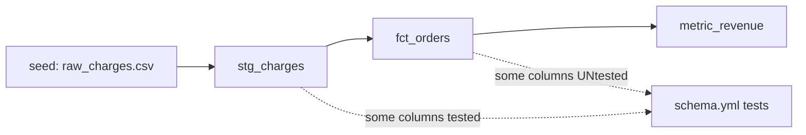

# M0 — The Breakable Fixture (full build guide)

> The foundation of the whole tool. M0 is a small, deliberately-imperfect dbt pipeline where **you control ground truth** — you know in advance exactly which columns are protected by tests and which aren't. Every later milestone validates its verdicts against the ground-truth table you write here. **If M0 is sloppy, you can never prove your tool is correct.**

**Domain:** deliberately generic (`charges → orders → revenue`). The point of M0 is *controlled ground truth*, not impressiveness — save domain flavor for the demo. Generic = easier to reason about which faults should be caught.

**Runs on:** DuckDB, locally on your M4. No Snowflake, no cloud.

**Time:** ~1–2 focused days. Don't rush the ground-truth table — it's the deliverable that matters most.

---

## What you're building

A 3-model dbt pipeline with a **deliberately incomplete** test suite:



Some columns are guarded by tests; some are intentionally left unguarded. The unguarded ones are where your Chaos Monkey will later prove faults slip through **silently** — so the gaps must be deliberate and documented, not accidental.

---

## Step 1 · dbt project skeleton

Inside your repo:

```bash
cd /Users/nisarg/data-chaos-monkey
mkdir -p fixture/dbt_project/{models/staging,models/marts,seeds}
cd fixture/dbt_project
```

Create `fixture/dbt_project/dbt_project.yml`:
```yaml
name: 'chaos_fixture'
version: '1.0.0'
profile: 'chaos_fixture'
model-paths: ["models"]
seed-paths: ["seeds"]
target-path: "target"
models:
  chaos_fixture:
    staging:
      +materialized: view
    marts:
      +materialized: table
```

Create the DuckDB profile at `fixture/dbt_project/profiles.yml` (keeping it local to the project keeps things clean):
```yaml
chaos_fixture:
  target: dev
  outputs:
    dev:
      type: duckdb
      path: 'chaos_fixture.duckdb'
      threads: 4
```

---

## Step 2 · Seed data (clean baseline)

Create `fixture/dbt_project/seeds/raw_charges.csv`. This is your **clean** starting data — everything valid, no nulls, no drift. Faults get injected *later*, on clones; the seed itself stays pristine.

```csv
charge_id,customer_id,amount,currency,status,created_at
1,101,49.99,USD,completed,2024-01-01 09:00:00
2,102,19.50,USD,completed,2024-01-01 09:05:00
3,103,120.00,EUR,completed,2024-01-01 09:10:00
4,101,15.00,USD,refunded,2024-01-01 09:15:00
5,104,89.99,GBP,completed,2024-01-01 09:20:00
6,105,49.99,USD,completed,2024-01-01 09:25:00
7,102,200.00,EUR,pending,2024-01-01 09:30:00
8,106,5.00,USD,completed,2024-01-01 09:35:00
9,103,75.50,GBP,completed,2024-01-01 09:40:00
10,107,49.99,USD,completed,2024-01-01 09:45:00
```

Note the deliberate variety: multiple currencies, a `refunded` and a `pending` status (so enum-drift faults have realistic targets later), a repeat customer.

---

## Step 3 · The models

**`fixture/dbt_project/models/staging/stg_charges.sql`** — clean/typecast the raw seed:
```sql
select
    charge_id,
    customer_id,
    amount,
    currency,
    status,
    created_at::timestamp as created_at
from {{ ref('raw_charges') }}
```

**`fixture/dbt_project/models/marts/fct_orders.sql`** — one row per completed charge, with a derived USD-normalized amount:
```sql
select
    charge_id as order_id,
    customer_id,
    amount,
    currency,
    -- naive conversion; the point is this depends on `currency` being valid
    case currency
        when 'USD' then amount
        when 'EUR' then amount * 1.08
        when 'GBP' then amount * 1.27
    end as amount_usd,
    status,
    created_at
from {{ ref('stg_charges') }}
where status = 'completed'
```

**`fixture/dbt_project/models/marts/metric_revenue.sql`** — total revenue (the business number a dashboard would show):
```sql
select
    date_trunc('day', created_at) as day,
    count(*) as order_count,
    sum(amount_usd) as total_revenue_usd
from {{ ref('fct_orders') }}
group by 1
```

**Notice the built-in fragility** (this is deliberate — it's what makes faults *bite*):
- `amount_usd` `CASE` has **no `else`** — a new/drifted currency value → `NULL` → understated revenue. *(enum-drift target)*
- `where status = 'completed'` — if the source stops writing `'completed'` and writes something else, orders silently vanish. *(enum-drift target)*
- `sum(amount_usd)` — any null in `amount_usd` silently drops from the sum. *(statistical-drift / type-coercion target)*

---

## Step 4 · The DELIBERATELY INCOMPLETE test suite

This is the heart of M0. Create `fixture/dbt_project/models/schema.yml` with tests on **some** columns and **intentionally none** on others:

```yaml
version: 2

models:
  - name: stg_charges
    columns:
      - name: charge_id
        tests: [not_null, unique]        # GUARDED
      - name: amount
        tests: [not_null]                # GUARDED
      - name: currency
        tests:
          - accepted_values:             # GUARDED (only known currencies)
              values: ['USD', 'EUR', 'GBP']
      # status:   INTENTIONALLY UNTESTED  <-- enum drift will slip through
      # customer_id: INTENTIONALLY UNTESTED

  - name: fct_orders
    columns:
      - name: order_id
        tests: [not_null, unique]        # GUARDED
      # amount_usd: INTENTIONALLY UNTESTED  <-- null from bad currency slips through
      # status:     INTENTIONALLY UNTESTED

  - name: metric_revenue
    columns:
      - name: total_revenue_usd
        tests: [not_null]                # GUARDED (but won't catch a WRONG-but-non-null number)
```

The gaps are the whole point: `status`, `amount_usd`, and `customer_id` are unguarded, so faults targeting them should later be reported **SILENT** by your tool. `charge_id`, `amount`, `currency`, `order_id` are guarded, so faults there should be **CAUGHT**.

---

## Step 5 · Build it green on clean data

```bash
cd /Users/nisarg/data-chaos-monkey/fixture/dbt_project
# use uv's environment
uv run dbt seed --profiles-dir .
uv run dbt run --profiles-dir .
uv run dbt test --profiles-dir .
```

**✅ done-when:** `dbt seed`, `dbt run`, and `dbt test` all pass green on the clean seed. If any test fails on clean data, your fixture is wrong — fix it before proceeding. (Clean data must pass; faults are what *break* it later.)

---

## Step 6 · Write the GROUND-TRUTH TABLE (the real deliverable)

Create `fixture/GROUND_TRUTH.md`. This is the artifact that lets you *prove* your tool is correct — it states, in advance, what verdict each fault *should* produce. When you build M5 (the verdict engine), you check its output against this table.

```markdown
# Fixture Ground Truth

For each (column, fault) the tool's verdict is validated against this table.
CAUGHT = a test should fire. SILENT = no test guards it, corruption reaches output.
CRASHED = the fault breaks schema/SQL so dbt run errors.

| Table       | Column         | Guarded by            | Fault injected            | Expected verdict |
|-------------|----------------|-----------------------|---------------------------|------------------|
| stg_charges | charge_id      | not_null, unique      | statistical_drift (nulls) | CAUGHT           |
| stg_charges | amount         | not_null              | statistical_drift (nulls) | CAUGHT           |
| stg_charges | currency       | accepted_values       | enum_drift ('BTC')        | CAUGHT           |
| stg_charges | status         | — (none)              | enum_drift ('processing') | SILENT           |
| stg_charges | customer_id    | — (none)              | statistical_drift (nulls) | SILENT           |
| fct_orders  | order_id       | not_null, unique      | statistical_drift (nulls) | CAUGHT           |
| fct_orders  | amount_usd     | — (none)              | type_coercion (round)     | SILENT           |
| fct_orders  | status         | — (none)              | enum_drift ('processing') | SILENT           |
| metric_revenue | total_revenue_usd | not_null       | statistical_drift (nulls) | CAUGHT           |
```

**This table is the M0 deliverable.** Everything downstream is graded against it. Take the time to make it exactly right — if you later find a verdict disagrees with this table, either your tool has a bug (good — you caught it) or your table was wrong (fix it and note why).

---

## Step 7 · Commit M0

```bash
cd /Users/nisarg/data-chaos-monkey
git add fixture/
git commit -m "M0: breakable fixture + ground-truth table"
git push
```

---

## ✅ M0 is done when
- [ ] `dbt seed && dbt run && dbt test` all pass green on clean data
- [ ] The fixture has both guarded and *intentionally unguarded* columns
- [ ] `fixture/GROUND_TRUTH.md` exists with the expected verdict for each (column, fault)
- [ ] The built-in fragilities (no-else CASE, status filter, null-summable revenue) are present
- [ ] Committed and pushed

---

## Why this matters (don't skip the ground truth)
The entire value of Chaos Monkey is *trust* — telling an engineer "this fault reaches your dashboard silently" is only credible if your tool is provably right. The ground-truth table is how you prove it: it's the answer key. Build the pipeline to have real, deliberate gaps, write down exactly where they are, and every later milestone has something objective to be validated against. A chaos tool without a ground-truth fixture is a tool that *hopes* it's right. Yours will *know*.

**Next:** M1 (loader) — but first, implement one fault (`statistical_drift`) and run it by hand against this fixture to feel the inject→run→verdict loop before automating it.
