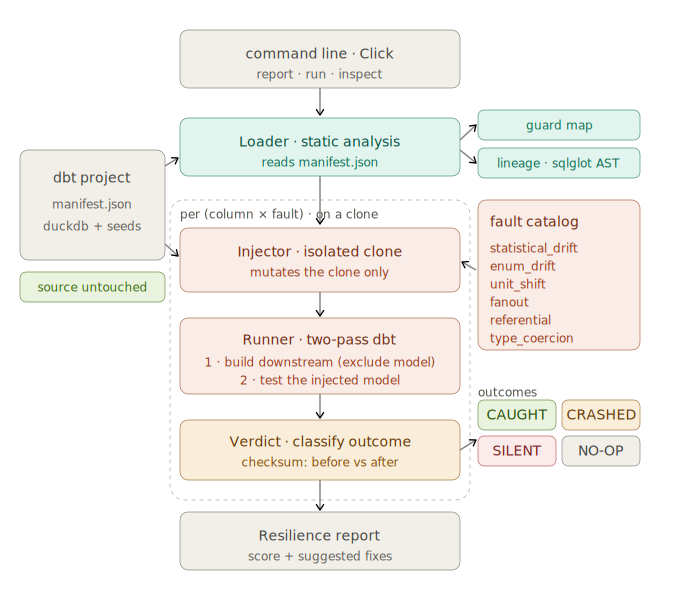

# Data Chaos Monkey 🐒💥


**Mutation testing for modern data pipelines.**

Data Chaos Monkey evaluates the integrity of your data pipeline's test suite by deliberately injecting schema drift and data corruption into source tables. It traces these faults through the DAG to mathematically prove which anomalies are caught by your tests, which cause execution crashes, and which slip through to production silently.

---

### Core Architecture



* **Isolated Clone:** The database is copied at the file level before any fault injection, so the source is never mutated — every run is checksum-identical on the production side. The clone is disposable and rebuilt per fault.
* **AST-Aware DAG Pruning:** Parses the `manifest.json` to identify the dependency graph. The engine dynamically appends `--select model+` to execute only the downstream nodes affected by the targeted mutation.
* **Streaming Output Checksums:** A `SUM(hash(row))` aggregate is pushed down into DuckDB to fingerprint the output. The hash is order-independent and memory-flat (a streaming aggregate), so the verdict's before/after diff holds at scale — benchmarked on 13.2M rows of deeply nested JSON.

---

## The Fault Catalog

The injector currently supports testing pipelines against common real-world failure modes:

| Mutation Type | Description | Target Vulnerability |
|---|---|---|
| `statistical_drift` | Forces high-volume `NULL` injection or extreme value skewing. | Tests the rigor of `not_null` constraints and statistical bounding tests. |
| `enum_drift` | Replaces valid categorical data with rogue strings or unexpected type casts. | Tests `accepted_values` constraints and pipeline type-safety limits. |
| `unit_shift` | Multiplies a numeric column by a constant (e.g. seconds→milliseconds, percent→ratio). | The classic silent killer: passes `not_null`, `unique`, and type checks. Caught only by `accepted_range`. |
| `fanout` | Duplicates a fraction of rows, breaking an assumed 1:1 join grain. | Tests `unique` constraints; otherwise silently inflates downstream aggregates. |
| `referential` | Rewrites foreign-key values to orphaned keys that reference nothing. | Tests `relationships` constraints; otherwise INNER JOINs silently drop rows. |
| `type_coercion` | Applies a lossy round-trip that preserves the declared type but destroys precision (e.g. `FLOAT`→`INT`→`FLOAT`, `TIMESTAMP`→`DATE`). | Passes `not_null`/`unique`/`accepted_values`. Type-aware — refuses and skips columns with no lossy op rather than guessing. |

---

## Getting Started

### Prerequisites
* Python 3.10+
* `uv` package manager
* A valid dbt project configured with DuckDB

### Installation
Clone the repository and sync dependencies:

```bash
git clone https://github.com/nisarg1505/data-chaos-monkey.git
cd data-chaos-monkey
uv sync
```

### Usage
Execute a resilience report against a specific dbt project and source table:

```bash
uv run chaos-monkey report \
  --db fixture/gharchive/gharchive.duckdb \
  --dbt-dir fixture/gharchive \
  --manifest fixture/gharchive/target/manifest.json \
  --output main.daily_metrics \
  --inject-into main.stg_events
```

> **Note:** the `--inject-into` target must be a model materialized as a **table**, not a view. Corruption injected into a view is recomputed away when dbt rebuilds the downstream DAG, which would produce unreliable verdicts. In the fixture, `stg_events` is materialized as a table for exactly this reason.

---

## Why GH Archive

The tool is validated against a real [GH Archive](https://www.gharchive.org/) pipeline — the public firehose of every GitHub event — because it is genuinely messy in the ways that hide silent data faults:

* **15 polymorphic event types**, each with a *different* payload schema in the same feed (`PushEvent`, `PullRequestEvent`, `IssueCommentEvent`, …).
* **Nested JSON up to 6 levels deep**, extracted through paths like `payload->'pull_request'->>'merged'`.
* **Up to 407 fields in a single payload**, versus 29 for a `PushEvent` — a ~14× schema-size spread within one table.
* **~13.2M events per run** (one hour of traffic), materialized locally on DuckDB with zero infrastructure.

That polymorphism is exactly where corruption slips past tests: a type coercion or null-drift buried in a JSON extraction won't trip a schema check, but it will quietly skew every downstream metric. The fault catalog targets those typed-from-JSON columns directly.

---

## Interpreting the Resilience Matrix

The output is a deterministic matrix classifying how your pipeline handled the injected faults.

```text
                  Pipeline Resilience Report                  
┏━━━━━━━━━━━━━━━━━━━━━━━━━━━━━━━━┳━━━━━━━━━┳━━━━━━━━━━━━━━━━━━━━━┓
┃ Fault                          ┃ Verdict ┃ Fix (if silent)     ┃
┡━━━━━━━━━━━━━━━━━━━━━━━━━━━━━━━━╇━━━━━━━━━╇━━━━━━━━━━━━━━━━━━━━━┩
│ id (statistical_drift)         │ SILENT  │ not_null test on id │
│ id (enum_drift)                │ CRASHED │ —                   │
│ type (statistical_drift)       │ CAUGHT  │ —                   │
│ type (enum_drift)              │ CAUGHT  │ —                   │
│ actor (statistical_drift)      │ CAUGHT  │ —                   │
│ repo (statistical_drift)       │ CAUGHT  │ —                   │
│ payload (statistical_drift)    │ CAUGHT  │ —                   │
│ public (statistical_drift)     │ CAUGHT  │ —                   │
│ created_at (statistical_drift) │ CAUGHT  │ —                   │
│ org (statistical_drift)        │ CAUGHT  │ —                   │
└────────────────────────────────┴─────────┴─────────────────────┘

Resilience: 8/10 faults caught
⚠ 1 reach output SILENTLY:
  • id (statistical_drift) → add not_null test on id
```

### Verdict Definitions

* **`CAUGHT`**: The injected corruption triggered an explicit failure in a defined `dbt test`. The bad data was successfully blocked.
* **`CRASHED`**: The mutation caused a hard infrastructure or casting failure (e.g., DuckDB type mismatch) during the `dbt run`.
* **`SILENT`**: **The pipeline leak.** The corrupted data slipped through all transformations and tests, reaching the `--output` table undetected. The engine suggests the missing dbt constraint needed to patch it.

---

## Roadmap
- [x] DuckDB Source Integration
- [x] O(1) Cryptographic Hash Engine
- [x] AST DAG Pruning (dbt-core)
- [ ] Snowflake / BigQuery support via adapter abstraction
- [ ] Column-level lineage tracing for exact blast radius mapping

## License
Distributed under the MIT License. See `LICENSE` for details.