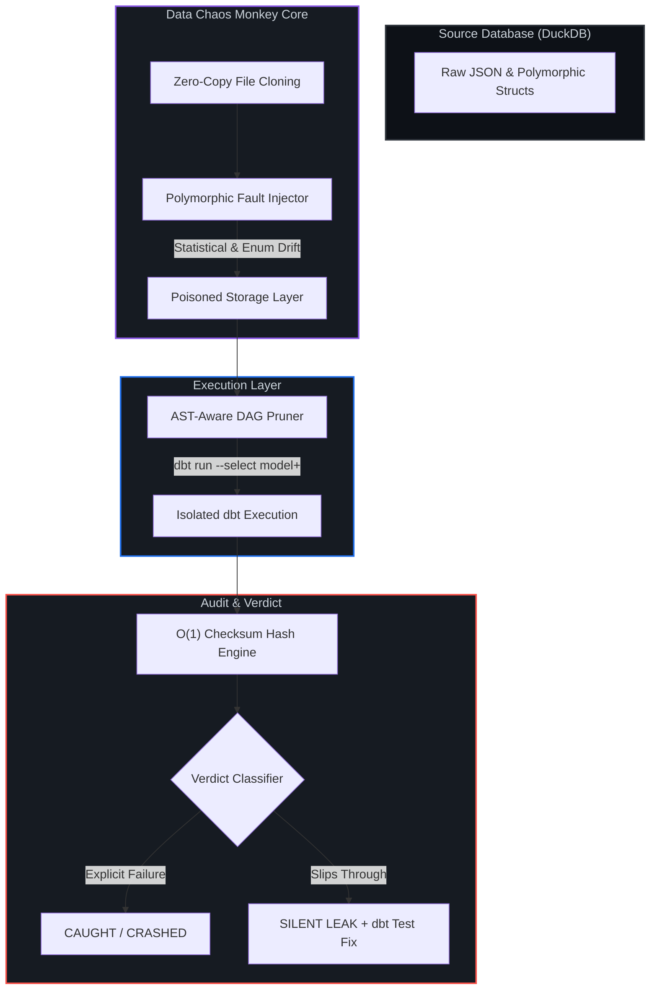

# Data Chaos Monkey 🐒💥

> **Prove your dbt tests actually work.**
> The first open-source mutation testing engine for modern data stacks. Inject real-world schema drift, prune your DAG, and audit pipeline resilience at scale.

---

## The Problem
Every data engineer has experienced this nightmare:
* Airflow shows green.
* `dbt test` shows a 100% pass rate.
* The CEO messages the team: *"Why are our active users down 40% on the dashboard?"*

Traditional data testing is static—it only checks what you *thought* to test. **Data Chaos Monkey** introduces active resilience testing to analytics engineering. It takes your physical data warehouse, injects real-world schema drift and corruption, runs your dbt transformations, and audits the downstream impact to find **silent data leaks**.

---

## Architecture & Design



1. Zero-Copy File Cloning: Safely isolates your source database by cloning the file state instantly before applying mutations, preventing disk bloat.

2. AST-Aware DAG Pruning: Dynamically parses your dbt manifest to run only the downstream models affected by the fault (--select model+), reducing redundant compute.

3. O(1) Memory Checksums: Pushes cryptographic hashing (SUM(hash())) down to the DuckDB storage layer, ensuring memory usage stays flat regardless of whether you process 800k or 13.2 million rows.

*Features*

1. Polymorphic Fault Catalog: Automatically handles deep nested JSON structs and types (statistical_drift for NULL injection, enum_drift for rogue type strings).

2. Automated Remediation Engine: If a fault reaches production silently, the engine outputs the exact dbt test (not_null, accepted_values) required to patch the leak.

3. Production-Grade Scale: Validated up to 13.2 million rows of deeply nested polymorphic JSON structs with a stable ~2.7GB memory footprint on consumer hardware.

*Installation & Quickstart*

Clone the repository and install dependencies using uv:

Bash
git clone [https://github.com/nisarg1505/data-chaos-monkey.git](https://github.com/nisarg1505/data-chaos-monkey.git)
cd data-chaos-monkey
uv sync
Running a Chaos Report
Run the resilience report against your dbt project and source tables:

Bash
uv run chaos-monkey report \
  --db fixture/gharchive/gharchive.duckdb \
  --dbt-dir fixture/gharchive \
  --manifest fixture/gharchive/target/manifest.json \
  --output main.actor_stats \
  --inject-into main.raw_events
Example Output

```text
                  Pipeline Resilience Report                  
┏━━━━━━━━━━━━━━━━━━━━━━━━━━━━━━━━┳━━━━━━━━━┳━━━━━━━━━━━━━━━━━━━━━┓
┃ Fault                          ┃ Verdict ┃ Fix (if silent)     ┃
┡━━━━━━━━━━━━━━━━━━━━━━━━━━━━━━━━╇━━━━━━━━━╇━━━━━━━━━━━━━━━━━━━━━┩
│ id (statistical_drift)         │ SILENT  │ not_null test on id │
│ id (enum_drift)                │ CRASHED │ —                   │
│ type (statistical_drift)       │ CAUGHT  │ —                   │
│ type (enum_drift)              │ CAUGHT  │ —                   │
│ actor (statistical_drift)      │ CAUGHT  │ —                   │
│ repo (statistical_drift)       │ CAUGHT  │ —                   │
│ payload (statistical_drift)    │ CAUGHT  │ —                   │
│ public (statistical_drift)     │ CAUGHT  │ —                   │
│ created_at (statistical_drift) │ CAUGHT  │ —                   │
│ org (statistical_drift)        │ CAUGHT  │ —                   │
└────────────────────────────────┴─────────┴─────────────────────┘

Resilience: 8/10 faults caught
⚠ 1 reach output SILENTLY:
  • id (statistical_drift) → add not_null test on id
```

*Verdict Classifications*

1. CAUGHT: The pipeline or dbt test failed explicitly, successfully blocking the corrupted data from reaching the output table.

2. CRASHED: The mutation caused a hard type-casting failure during execution, halting the pipeline.

3. SILENT: The million-dollar bug. The corrupted data slipped through all transformations and tests, reaching the final dashboard undetected without throwing an error.

License
Distributed under the MIT License. See LICENSE for more information.