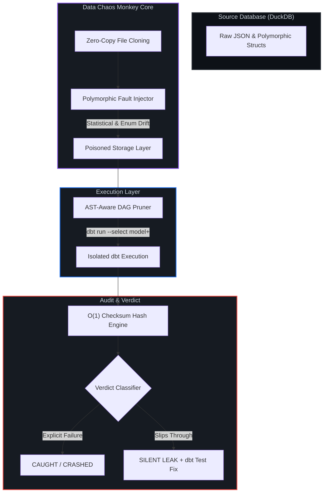

# Data Chaos Monkey 🐒💥


**Mutation testing for modern data pipelines.**

Data Chaos Monkey evaluates the integrity of your data pipeline's test suite by deliberately injecting schema drift and data corruption into source tables. It traces these faults through the DAG to mathematically prove which anomalies are caught by your tests, which cause execution crashes, and which slip through to production silently.

---

## Mechanism of Action

Traditional data quality relies on static assertions—testing for what you *expect* to happen. Data Chaos Monkey introduces **active mutation testing** to prove your tests actually catch the *unexpected*.



### Core Architecture

* **Zero-Copy Isolation:** Database state is cloned at the file level instantly before fault injection, preventing disk bloat and maintaining a pristine source state.
* **AST-Aware DAG Pruning:** Parses the `manifest.json` to identify the dependency graph. The engine dynamically appends `--select model+` to execute only the downstream nodes affected by the targeted mutation.
* **O(1) Storage Checksums:** Cryptographic hashing (`SUM(hash())`) is pushed down to the DuckDB execution engine. This ensures the memory footprint remains flat regardless of data volume (benchmarked up to 13.2M rows of deeply nested JSON).

---

## The Fault Catalog

The injector currently supports testing pipelines against common real-world failure modes:

| Mutation Type | Description | Target Vulnerability |
|---|---|---|
| `statistical_drift` | Forces high-volume `NULL` injection or extreme value skewing. | Tests the rigor of `not_null` constraints and statistical bounding tests. |
| `enum_drift` | Replaces valid categorical data with rogue strings or unexpected type casts. | Tests `accepted_values` constraints and pipeline type-safety limits. |

---

## Getting Started

### Prerequisites
* Python 3.10+
* `uv` package manager
* A valid dbt project configured with DuckDB

### Installation
Clone the repository and sync dependencies:

```bash
git clone [https://github.com/nisarg1505/data-chaos-monkey.git](https://github.com/nisarg1505/data-chaos-monkey.git)
cd data-chaos-monkey
uv sync
```

### Usage
Execute a resilience report against a specific dbt project and source table:

```bash
uv run chaos-monkey report \
  --db fixture/gharchive/gharchive.duckdb \
  --dbt-dir fixture/gharchive \
  --manifest fixture/gharchive/target/manifest.json \
  --output main.actor_stats \
  --inject-into main.raw_events
```

---

## Interpreting the Resilience Matrix

The output is a deterministic matrix classifying how your pipeline handled the injected faults.

```text
                  Pipeline Resilience Report                  
┏━━━━━━━━━━━━━━━━━━━━━━━━━━━━━━━━┳━━━━━━━━━┳━━━━━━━━━━━━━━━━━━━━━┓
┃ Fault                          ┃ Verdict ┃ Fix (if silent)     ┃
┡━━━━━━━━━━━━━━━━━━━━━━━━━━━━━━━━╇━━━━━━━━━╇━━━━━━━━━━━━━━━━━━━━━┩
│ id (statistical_drift)         │ SILENT  │ not_null test on id │
│ id (enum_drift)                │ CRASHED │ —                   │
│ type (statistical_drift)       │ CAUGHT  │ —                   │
│ type (enum_drift)              │ CAUGHT  │ —                   │
│ actor (statistical_drift)      │ CAUGHT  │ —                   │
│ repo (statistical_drift)       │ CAUGHT  │ —                   │
│ payload (statistical_drift)    │ CAUGHT  │ —                   │
│ public (statistical_drift)     │ CAUGHT  │ —                   │
│ created_at (statistical_drift) │ CAUGHT  │ —                   │
│ org (statistical_drift)        │ CAUGHT  │ —                   │
└────────────────────────────────┴─────────┴─────────────────────┘

Resilience: 8/10 faults caught
⚠ 1 reach output SILENTLY:
  • id (statistical_drift) → add not_null test on id
```

### Verdict Definitions

* **`CAUGHT`**: The injected corruption triggered an explicit failure in a defined `dbt test`. The bad data was successfully blocked.
* **`CRASHED`**: The mutation caused a hard infrastructure or casting failure (e.g., DuckDB type mismatch) during the `dbt run`.
* **`SILENT`**: **The pipeline leak.** The corrupted data slipped through all transformations and tests, reaching the `--output` table undetected. The engine suggests the missing dbt constraint needed to patch it.

---

## Roadmap
- [x] DuckDB Source Integration
- [x] O(1) Cryptographic Hash Engine
- [x] AST DAG Pruning (dbt-core)
- [ ] Snowflake / BigQuery support via adapter abstraction
- [ ] Column-level lineage tracing for exact blast radius mapping

## License
Distributed under the MIT License. See `LICENSE` for details.